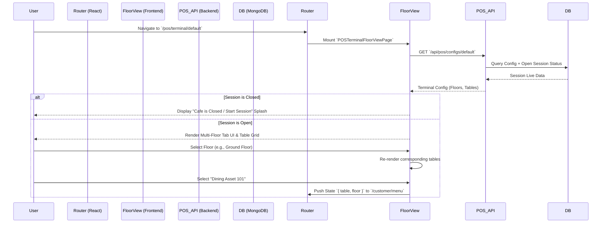

# Odoo POS Cafe — Terminal Floor View & Table Selection Module
## Engineering & Technical Documentation Pack v5.0

> [!NOTE]
> **Module Purpose**
> This advanced layer of the Odoo POS Cafe acts as the **primary customer and POS-facing interaction point**. It seamlessly bridges terminal session management, real-time spatial navigation (Floor Switching), and Table Selection. This module guarantees proper table alignment before engaging the high-fidelity MERN Dine-In Ordering engine.

---

### 1. Architectural Overview & Workflows

The module operates on a strict sequence, refusing to allow ordering until an authenticated session validates a floor and table selection. It leverages a robust dual-layer structure between the React Frontend and the Node/Express backend. 



---

### 2. Role-Based Access Control (RBAC) Matrix

A core requirement of this module is distinguishing between *Back-Office Configuration* and *Customer Front-End Access*. Route protection ensures safety while delivering a frictionless customer experience.

| Role | Floor Nav Access | Table Select Access | Menu Navigation | Can End Session | Route Bound |
|:---|:---:|:---:|:---:|:---:|:---|
| **Manager/Admin** | ✅ Full Setup | ✅ Bypass | ✅ (Testing) | ✅ | `/admin/*` & `/pos/*` |
| **Cashier/Staff** | ✅ Operations | ✅ Order Taking | ✅ Order Entry | ✅ | `/pos/*` |
| **Kitchen Staff** | ❌ Restricted | ❌ Restricted | ❌ Restricted | ❌ | `/kitchen` |
| **Customer** | ✅ View Only | ✅ Guest Entry | ✅ Self-Order | ❌ | `/customer/*` |

> [!WARNING]
> **Security Bound:** Although the **Customer** role can access the Floor plan to tap their table, they are sandboxed. They cannot close the POS terminal or manipulate the physical table shapes, capacities, or limits.

---

### 3. Frontend UI/UX Engineering: *The "Cafe Luxe" Aesthetic*

The UI ditches the standard heavy POS look in favor of an airy, high-contrast, light-themed aesthetic. It employs a premium Glassmorphism-lite methodology driven entirely by **Tailwind CSS**.

#### Design System Keys
- **Typography**: Uses `font-display` (e.g., Outfit/Inter) for bold, tracking-widest headers and structured metric values.
- **Color Palette**: Foundations of `cream-50` and `stone-50`, accented dynamically by `cafe-600` (Amber/Orange) depending on table states.
- **Micro-Animations**: Hover actions use `transition-all duration-300`, while page loads are governed by `animate-fade-in` and `animate-slide-up`.

#### The Table Identifier Algorithm (Clean UI)
To prevent visual redundancy (e.g., replacing "Table 101 - Table 101" with "101 • Dining Asset"), custom nomenclature sanitization is achieved during rendering:

```jsx
{/* Extracting pure ID vs Nomenclature */}
<div className="w-10 h-10 rounded-full border border-stone-200 bg-white flex items-center justify-center text-sm font-bold text-stone-900 shadow-sm shrink-0">
  {table.tableNumber}
</div>
<span className="font-semibold text-sm text-stone-700 tracking-wide">
  Dining Asset
</span>
```

---

### 4. Code Deep-Dive: Core Business Logic

#### A. Terminal Booting & Protection (`pos.js` Backend snippet)
The backend enforces that when hitting the default endpoints, it prioritizes a configuration with an active session.

```javascript
// server/routes/pos.js (GET /configs/default)
router.get('/configs/default', async (req, res) => {
  // 1. Prioritize active sessions to prevent redirecting customers to closed pages
  let config = await POSConfig.findOne({ hasActiveSession: true })
    .populate('floorPlans.floors');
    
  if (!config) {
     // 2. Fallback to generic if everything is closed
     config = await POSConfig.findOne().populate('floorPlans.floors');
  }
  
  res.json({ success: true, config });
});
```

#### B. Floor Switching Mechanism (Frontend)
The multi-floor switcher uses controlled component state to glide between blueprints without reloading the browser.

```jsx
// React State hook mapping active selection
const [activeFloorIndex, setActiveFloorIndex] = useState(0);

// Rendering the Interactive Selection Pills
<div className="flex gap-2 border-b border-stone-100 px-6 py-2 overflow-x-auto">
  {currentConfig.floorPlans.floors.map((floor, idx) => (
    <button
      key={floor._id}
      onClick={() => setActiveFloorIndex(idx)}
      className={`px-5 py-2.5 rounded-full text-[11px] font-black uppercase tracking-widest transition-all ${
        activeFloorIndex === idx
          ? 'bg-stone-900 text-white shadow-xl translate-y-[-2px]'
          : 'bg-white text-stone-400 hover:text-stone-700 border border-stone-100'
      }`}
    >
      {floor.name}
    </button>
  ))}
</div>
```

---

### 5. MongoDB Ecosystem Integration

When a customer maps directly to a table, that context is injected into their Order Schema payload. This replaces abstract ordering with highly structured Dine-In data.

#### Core Model Fields (`server/models/Order.js`)
```javascript
const orderSchema = new mongoose.Schema({
  // ... auth/id fields
  table: {
    type: mongoose.Schema.Types.ObjectId,
    ref: 'Table',
    required: false // Optional to allow takeaway, but required for floor-orders
  },
  floor: {
    type: mongoose.Schema.Types.ObjectId,
    ref: 'Floor',
    required: false
  },
  notes: {
    type: String,
    trim: true,
    maxlength: 500
  }
});
```

---

### 6. Error Handling & Validation Matrix

The module must gently guide users away from unrecoverable network or logical states:

| Scenario | Trigger Mechanism | UX Response | Technical Execution |
| :--- | :--- | :--- | :--- |
| **No Active Session** | DB `hasActiveSession: false` | Render Full-screen "Store Closed" splash. | Conditional render `<StoreClosedSplash />`. Halt API hooks. |
| **Network Failure** | Express throws `5xx` / Axios fails | Premium capsule toast displays standard error. | `toast.error("Failed to load floor plans")`. Retry button enabled. |
| **Empty Floor** | Floor object has `tables.length === 0` | Elegant empty state. | `<Search className="w-8 h-8 opacity-20"/> <p>No Active Assets</p>`. |
| **Invalid Table Selected** | Navigating with `null` table ID | Bounce back to floor plan instantly. | `useEffect` validation block inside `CustomerMenuPage`. |

---

### 7. Performance & Optimization Strategy

1. **Memoization of Floor Context**: The active tables array is memoized using `useMemo` so React doesn't recalculate the array mapping on every micro-state change (like notifications or hover states).
2. **Payload Reduction**: `populate()` commands from mongoose are strictly limited to `name`, `tableNumber`, and physical positions. Deeply nested configurations aren't pulled over the network.
3. **No-Wait UI Loading**: Instead of a blank white screen during API latency, the module immediately renders an `animate-pulse` framework showing the skeleton of the "Odoo POS Cafe" structure.

### Conclusion 
The structural integrity of the Terminal Floor Module ensures zero-friction table identification. By pairing rapid React-state spatial switching with hardened Backend-Session safety checks, the Odoo POS Cafe guarantees that orders are always routed securely to the correct table, floor, and session context at blazing speed.
