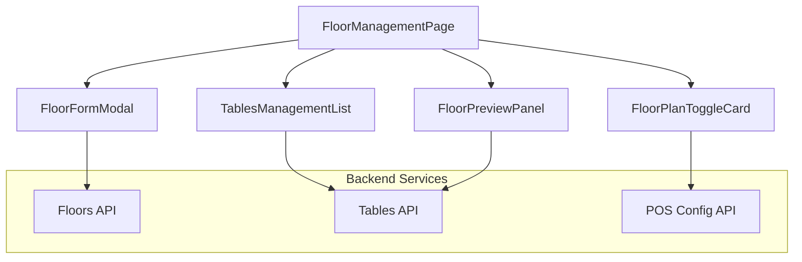

# Technical Documentation: Floor Plan and Table Management Module
**Project:** Odoo POS Cafe — Intelligent Restaurant POS System  
**Version:** 1.0.0  
**Stack:** MERN (MongoDB, Express, React, Node.js) + Tailwind CSS

---

## 1. Module Overview
The **Floor Plan and Table Management Module** acts as the operational seating intelligence layer for the Odoo POS Cafe. It provides the structured infrastructure required for dine-in operations, allowing managers to digitize their physical restaurant layout into an actionable system. By organizing tables into floors and assigning them to specific POS terminals, the system ensures that guest seating is optimized and order tracking is location-aware.

### Core Objectives:
*   **Seating Digitization**: Transform physical floor zones into digital management cards.
*   **Operational Readiness**: Enable or disable floor planning per POS terminal to switch between Quick-Service and Dine-In modes.
*   **Asset Management**: Maintain a granular catalog of tables with specific seat counts and maintenance states.
*   **Role-Protected Configuration**: Ensure only authorized managerial roles can modify the restaurant's physical architecture.
*   **Visual Blueprint**: Provide a mini-visual preview for immediate staff orientation.

---

## 2. Architecture & System Flow

### 2.1 Component Architecture
The module is built with a highly modular React structure designed for performance and operational clarity.



---

## 3. Data Models (MongoDB Schemas)

### 3.1 Floor Schema
Stores the structural areas within the restaurant.

| Field | Type | Description | Rules |
| :--- | :--- | :--- | :--- |
| `name` | String | Unique name per POS | 2-50 chars, Required |
| `posConfig` | ObjectId | Linked POS Terminal | Required |
| `isActive` | Boolean | Selection visibility | Default: `true` |
| `createdBy` | ObjectId | Owner reference | Required |

### 3.2 Table Schema
Represents individual seating assets.

| Field | Type | Description | Rules |
| :--- | :--- | :--- | :--- |
| `tableNumber` | String | Unique label per floor | Max 20 chars, Required |
| `floor` | ObjectId | Parent floor zone | Required |
| `seatsCount` | Number | Maximum capacity | 1-50, Default: 4 |
| `isActive` | Boolean | Maintenance mode flag | Default: `true` |
| `createdBy` | ObjectId | Creator reference | Required |

---

## 4. Role-Based Access Control (RBAC)

Granular permissions ensure that only managers can "architect" the restaurant floor, while cashiers focus on daily operation visibility.

| Feature | Manager / Admin | POS Staff / Cashier | Kitchen Staff | Customer |
| :--- | :---: | :---: | :---: | :---: |
| **Enable/Disable Floor Plans**| ✅ Yes | ❌ No | ❌ No | ❌ No |
| **Create/Edit Floors** | ✅ Yes | ❌ No | ❌ No | ❌ No |
| **Add/Edit Tables** | ✅ Yes | ❌ No | ❌ No | ❌ No |
| **Bulk Actions (Dup/Del)** | ✅ Yes | ❌ No | ❌ No | ❌ No |
| **View Visual Blueprint** | ✅ Yes | ✅ Yes | ❌ No | ❌ No |
| **Toggle Asset Status** | ✅ Yes | ❌ No | ❌ No | ❌ No |

---

## 5. API Endpoints & Business Logic

### 5.1 Endpoint Definitions
*   `GET /api/floors` — Fetch floors filtered by `posConfig`.
*   `POST /api/floors` — Create new floor with conflict detection.
*   `GET /api/tables` — Fetch tables for a specific floor.
*   `POST /api/tables/bulk/duplicate` — Clones selected table IDs with intelligent numbering.
*   `DELETE /api/tables/bulk` — Permanently removes selected dining assets.

### 5.2 Critical Function: Intelligent Duplication
```javascript
// Server-side duplication logic
originals.map(original => ({
  tableNumber: `${original.tableNumber}-copy`,
  floor: original.floor,
  seatsCount: original.seatsCount,
  createdBy: req.user._id
}));
```

---

## 6. UI/UX & Design Philosophy

### 6.1 Design Tokens (Light Mode Focus)
*   **Background**: `bg-cream-50` for a warm, welcoming hospitality vibe.
*   **Highlight Accent**: `cafe-500` (Terracotta/Amber) for focal primary actions.
*   **Status Indicators**: 
    *   **Active**: Emerald green ripple with pulse animation.
    *   **Maintenance**: Grayscale/Neutral slate for inactive units.
*   **Shadow System**: `shadow-card` (Layered 12%) for depth on elevated cards.

### 6.2 Layout Experience
1.  **Preparation Level**: The page begins with a Setup Card where the user selects the terminal.
2.  **Architectural Layout**: Left sidebar handles floor navigation; Main area handles table inventory.
3.  **Contextual Toolbars**: Bulk actions (Duplicate/Delete) only appear when checkboxes are selected.

---

## 7. Business Rules & Validations

| Event | Rule | System Response |
| :--- | :--- | :--- |
| **Duplicate Table No.**| No two tables on the same floor can share a number. | 400 "Table number already exists". |
| **Floor Deletion** | Soft delete only to protect existing order history. | Hides from POS UI but preserves records. |
| **Maintenance Mode** | Inactive tables cannot be assigned new orders. | Removed from visual floor in Service Module. |
| **Terminal Switch** | Switching POS Config immediately re-syncs floor list. | Dynamic React state update for zero lag. |

---

## 8. Frontend & Backend Architecture

### Frontend Components
*   `FloorManagementPage.jsx`: Root controller for seating intelligence.
*   `FloorPlanToggleCard.jsx`: Feature activation & POS switcher.
*   `TablesManagementList.jsx`: High-performance operational table.
*   `FloorPreviewPanel.jsx`: Visual blueprint/mini-map implementation.

### Security Implementation
RBAC is enforced via specialized middleware at the route level:
```javascript
router.delete('/bulk', authorize('manager'), async (req, res) => { ... });
```

---
*End of Technical Resource Pack — Floor Plan & Table Management Module*
