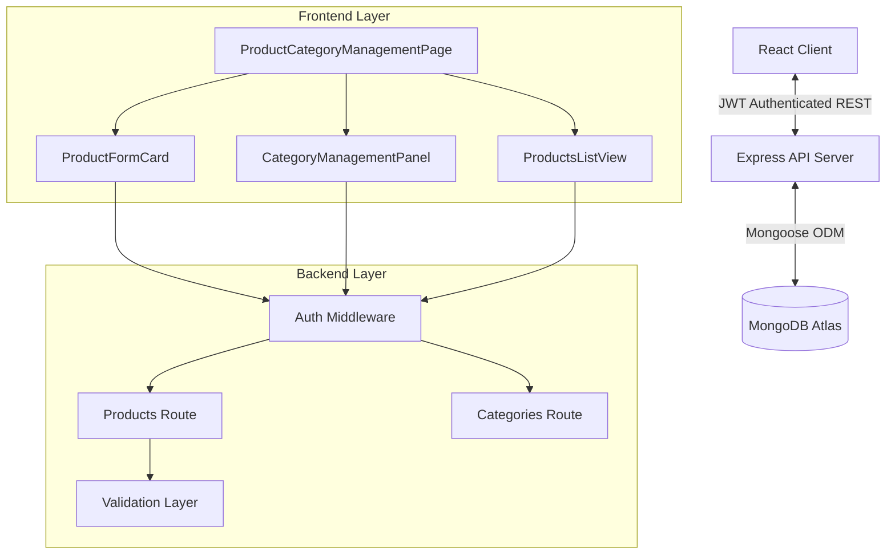

# Technical Documentation: Products, Variants, and Category Management Module
**Project:** Odoo POS Cafe — Intelligent Restaurant POS System  
**Version:** 1.0.0  
**Stack:** MERN (MongoDB, Express, React, Node.js) + Tailwind CSS

---

## 1. Module Overview
The **Products, Variants, and Category Management Module** serves as the foundational data layer for the Odoo POS Cafe system. It is the centralized hub where authorized users define the restaurant's menu, organize items into logical categories, and manage complex product configurations such as variants (e.g., sizes, flavors) and tax rules.

This module ensures that the POS frontend has access to a structured, high-performance catalog, enabling fast ordering and accurate pricing.

### Core Objectives:
*   **Menu Orchestration**: Create and maintain a hierarchy of food and beverage offerings.
*   **Variant Management**: Define flexible attributes (size, extras) with dynamic price adjustments.
*   **Category-Based Logic**: Organize items with color-coded identifiers for rapid visual recognition in high-traffic POS environments.
*   **Fiscal Compliance**: Enforce standardized tax rates and Units of Measure (UOM).
*   **Enterprise Security**: Implement granular Role-Based Access Control (RBAC) to protect sensitive pricing and inventory data.

---

## 2. Architecture & Data Flow

### 2.1 System Architecture
The module follows a decoupled architecture where the React frontend communicates with a RESTful Node/Express backend, persisted by a MongoDB database.



---

## 3. Data Models (MongoDB Schemas)

### 3.1 Category Schema
Stores the structural groupings for products.

| Field | Type | Description | Rules |
| :--- | :--- | :--- | :--- |
| `name` | String | Unique display name | 2-40 chars, Required |
| `color` | String | Hexadecimal visual ID | Default: `#F59E0B` |
| `isActive` | Boolean | Soft-delete flag | Default: `true` |
| `createdBy` | ObjectId | Reference to `User` | Required |

### 3.2 Product Schema
The primary record for menu items, supporting embedded variants.

| Field | Type | Description | Rules |
| :--- | :--- | :--- | :--- |
| `name` | String | Product name | 2-100 chars, Required |
| `category` | ObjectId | Reference to `Category` | Optional (null allowed) |
| `salePrice` | Number | Base selling price | Min: 0, Required |
| `tax` | Number | Applied tax percentage | Enum: [0, 5, 12, 18, 28] |
| `uom` | String | Unit of Measure | Enum: [Unit, Kg, Liter, Pack] |
| `variants` | Array | Nested Variant objects | See Variant Sub-schema |
| `isActive` | Boolean | Visibility flag | Default: `true` |

#### Variant Sub-schema (Embedded)
| Field | Type | Description |
| :--- | :--- | :--- |
| `attribute` | String | Context (e.g., "Size", "Milk Type") |
| `value` | String | Option (e.g., "Large", "Oat") |
| `extraPrice` | Number | Added cost to base `salePrice` |

---

## 4. Role-Based Access Control (RBAC)

Access to product data is strictly governed by the user's role defined in the JWT payload.

| Feature | Manager / Admin | POS Staff / Cashier | Kitchen Staff | Customer |
| :--- | :---: | :---: | :---: | :---: |
| **Create/Edit Products** | ✅ Yes | ❌ No | ❌ No | ❌ No |
| **Delete/Archive Products**| ✅ Yes | ❌ No | ❌ No | ❌ No |
| **Manage Categories** | ✅ Yes | ❌ No | ❌ No | ❌ No |
| **View Product List** | ✅ Yes | ✅ Yes | ✅ Yes | ✅ Yes |
| **View Pricing details** | ✅ Yes | ✅ Yes | ❌ No | ✅ Yes |
| **Apply Bulk Actions** | ✅ Yes | ❌ No | ❌ No | ❌ No |

### Security Implementation Snippet (Backend):
```javascript
// Protected Route Example
router.post(
  '/',
  protect,           // Verify JWT
  authorize('manager'), // Restrict to Manager role
  productController.create
);
```

---

## 5. API Endpoints

### 5.1 Category Management
*   `GET /api/categories` — Retrieves all active categories. (Manager, Cashier)
*   `POST /api/categories` — Creates new category with name/color. (Manager)
*   `PUT /api/categories/:id` — Updates existing category. (Manager)
*   `DELETE /api/categories/:id` — Soft-deletes category. (Manager)

### 5.2 Product Management
*   `GET /api/products` — List products with search/filter. (All Roles)
*   `POST /api/products` — Primary creation point. (Manager)
*   `PUT /api/products/:id` — Multi-tab update (General/Variants). (Manager)
*   `DELETE /api/products/bulk` — Hard delete selected items. (Manager)

---

## 6. UI/UX Design System

### 6.1 Aesthetic & Visual Grammar
The module utilizes the **"Cafe Luxe"** design system:
*   **Palette**: Warm stones, cream backgrounds, and "Cafe Gold" (#D97706) accents.
*   **Typography**: Serif font headers (Inter/Display) for a premium restaurant feel.
*   **Components**: Glassmorphism effects, soft-rounded corners (2xl), and subtle micro-animations.

### 6.2 Key Views
1.  **Product List View**: High-density table with multi-select capability and status badges.
2.  **Product Form (Modal/Card)**:
    *   **Tab A: General Info**: Essential metadata (Name, Category, Base Price, Tax).
    *   **Tab B: Variants**: Dynamic row-builder for managing complex product variations.
3.  **Category Panel**: Interactive color-picking grid for visual grouping.

### 6.3 Specialized Logic: Category Chips
Categories are rendered using dynamic color calculation to ensure accessibility and high-quality aesthetics.
```javascript
function getChipStyle(color) {
  // Generates accessible pastel background and high-contrast text color
  return {
    backgroundColor: `${color}1F`,  // 12% Opacity
    color: darken(color, 20),      // Custom darkening logic
    borderColor: `${color}40`,     // 25% Opacity
  };
}
```

---

## 7. Business Rules & Validations

| Case | Rule | Behavior |
| :--- | :--- | :--- |
| **Duplicate Category** | Name must be unique (case-insensitive). | Returns 400 "Category already exists". |
| **Soft Delete** | Archiving a category hides it from lists. | Products remain linked but category appears as "(Archived)" in UI. |
| **Price Safety** | salePrice cannot be negative. | Frontend/Backend validation enforcement. |
| **Variant Pricing** | extraPrice is added to base price. | Calculation occurs in Order Module during cart addition. |
| **Tax Rules** | Must conform to standard GST/VAT brackets. | Strictly enforced by enum values [0-28]. |

---

## 8. Development & Deployment Workflow

1.  **Environment Setup**: Configure `MONGODB_URI` and `JWT_SECRET` in `.env`.
2.  **Data Seeding**: Run `node server/seeds/seedCategories.js` to initialize the visual catalog.
3.  **Execution**:
    *   Server: `npm run dev:server` (Port 5000)
    *   Client: `npm run dev:client` (Port 8080)
4.  **Testing**:
    *   **Unit**: Test variant price calculation.
    *   **Integration**: Verify RBAC middleware blocks non-managerial POST requests.
    *   **UX**: Validate responsiveness on mobile (grid to list collapse).

---
*End of Document — Odoo POS Cafe Technical Resource Pack*
